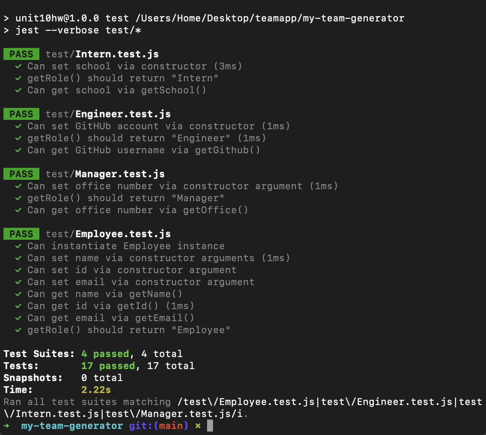

 

# My Team Generator

## Description
A Node CLI that dynamically generates an HTML webpage displaying a team roster from a user's input using the Inquirer package. The application is written in Javascript and node.js. The dependencies are, jest for running the provided tests, and inquirer for collecting input from the user.

### User Story

> As a **manager**, I want to **generate a webpage that displays my team's basic info** so that **I have quick access to emails and GitHub profiles**.


## Table of Contents
- [Preview](#Preview)
- [Execute](#Execute)
- [Usage](#Usage)
- [Contributing](#Contributing)
- [Test](#Test)
- [License](#License)
- [Environment](#Environment)
- [Questions](#Questions)

## Preview

> Watch a full demo video on my [YouTube channel]()

Answering promtps in the Node CLI. 


This assignment required passing all unit tests to help you build the classes correctly.



The outputted HTML webpage displays the team roster with a modern UI using Bootstrap cards and utilities.


## Execute
```node app.js```

Invoke the team generator application in your command line using the above command.

## Usage
The application will prompt the user for information about the team manager and then information about the team members. The user can input any number of team members, and they may be a mix of engineers and interns. The generated HTML file will be outputted to the output folder within the repo folder.

## Contributing
Contributions are welcomed.

## Test
Feel free to explore and feedback with any suggestions or improvements.

## License
MIT

## Environment
* [Visual Studio Code](https://code.visualstudio.com/)
* Mac Terminal
* [Git](https://git-scm.com/book/en/v2/Getting-Started-Installing-Git)
* [Node.js](https://nodejs.org/en/)
* [NPM](https://www.npmjs.com/)
* [Inquirer](https://www.npmjs.com/package/inquirer)
* [Node Emoji](https://www.npmjs.com/package/node-emoji)
* [Jest](https://jestjs.io/)
* [Bootstrap](https://getbootstrap.com/)

## Questions
Follow me on [GitHub: rubybassi](https://github.com/rubybassi)

If you have any additional questions, simply email me at <thecodingfiles@gmail.com> and i'll respond as soon as possible.